# Hello there!

I'm a first-year doctoral researcher in astrophysics at Kiel University, Germany. I graduated from Heidelberg, where I worked in the field of massive star formation at the Max Planck Institute for Astronomy (MPIA) during both my Bachelor's and Master's Theses.

My current research focuses on planet formation, particularly on the optical properties of water-ice and silicate dust grains in protoplanetary disks.

## Currently working on

- **Water ice in dust grains** inside protoplanetary disks
- **Discrete Dipole Approximation (DDA)** of dust grains using DDSCAT
- Optical properties of **water-ice and silicate mixtures**
- Comparison of numerical dust models with laboratory measurements

## Languages

  

## Tools

  
  
  
  
  

## Research interests

`Star Formation` · `Planet Formation` · `Protoplanetary Disks`
